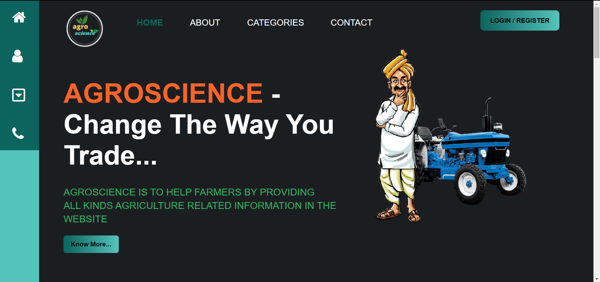
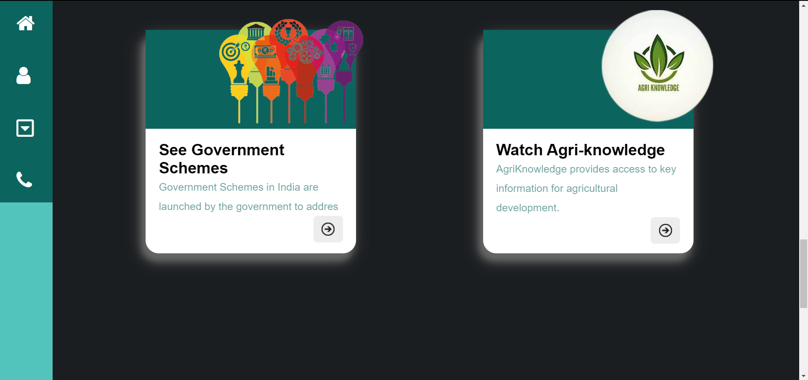
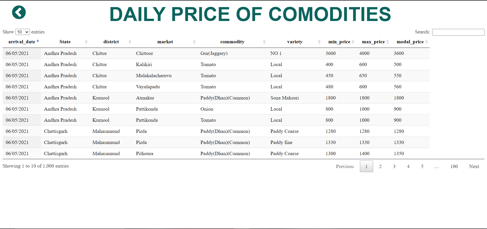
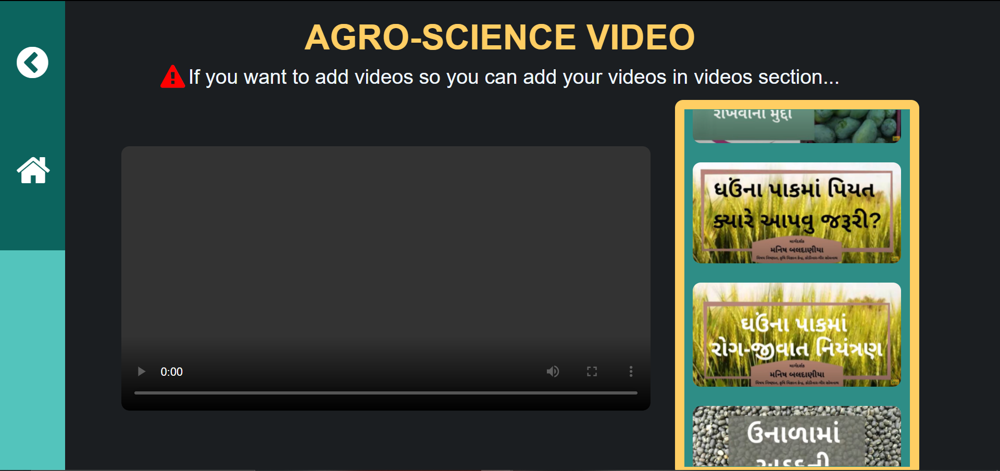
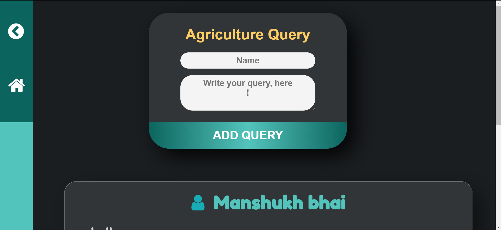
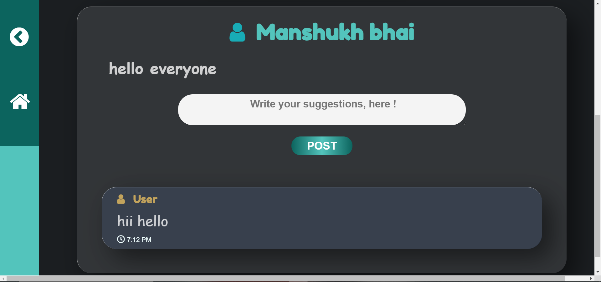
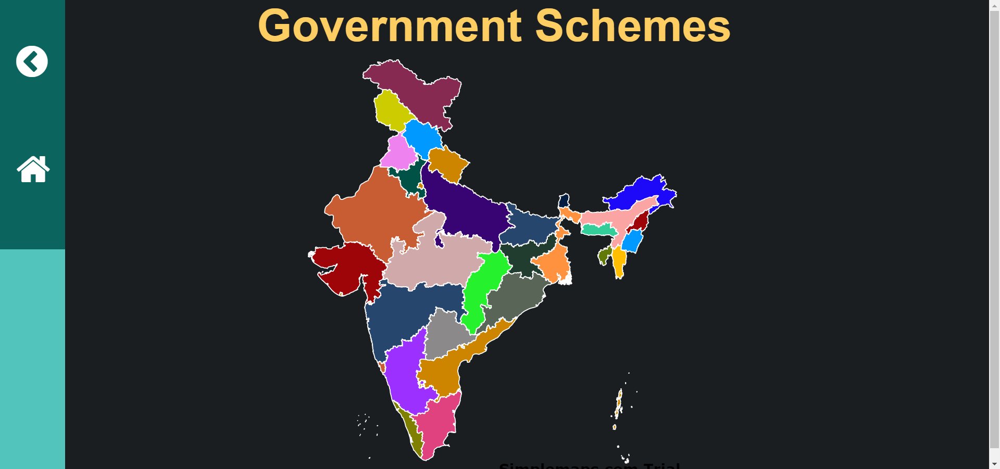
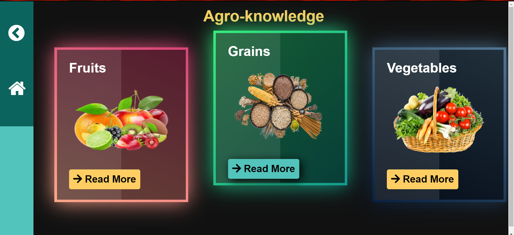
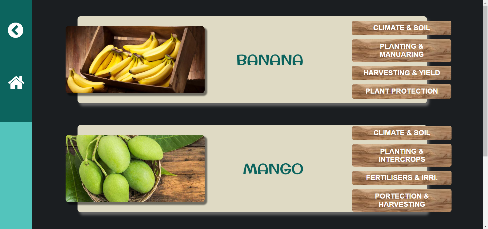
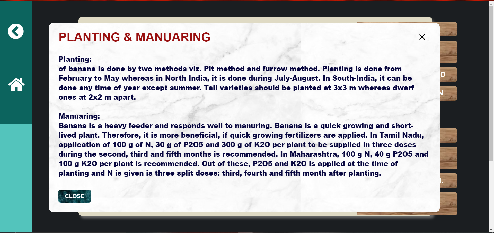

# Agro-Science
Agro Science website is an agriculture based web-portal to help farmer.

## Getting started

The main aim of Agro Scienc.e Website is to help farmers of rural areas in every possible way. We use HTML5, CSS, JAVA SCRIPT for Frontend Development.

This project will run on NodeJs using MongoDB as a database.


## Features

- Basic Authentication (Register/Login with hashed password)
- Daily price of various comodities of different mandi.
- Agriculture related videos (Currently not available).
- Government Schemes of different states (static data).
- Add query and any user can reply.
- Agri knowledge.

## Software Requirements

- Node.js
- MongoDB

## How to install

### Using manual download ZIP

1.  Download repository
2.  Uncompress to your desired directory

### Install npm dependencies after installing (Git or manual download)

```bash
npm install
```

## API integration 

Go to given link and get your own API key in XML format 

```bash
https://data.gov.in/resources/current-daily-price-various-commodities-various-markets-mandi/api
```

Example of API

```bash
https://api.data.gov.in/resource/9ef84268-d588-465a-a308-a864a43d0070?api-key=579b464db66ec23bdd0000019b3d122ad1e844b1767aa69c3fe17d2c&format=json&offset=0&limit=1000&filters=state
```

Add your API url in data.ejs file in views folder.

## How to run

### Running API server locally

```bash
node app.js
```
If you have nodemon package then,

```bash
nodemon app.js
```

You will know server is running by checking the output of the command `node app.js`


## Bugs or improvements

Every project needs improvements, Feel free to report any bugs or improvements. Pull requests are always welcome.

### bugs
- Server side validation for Login/ Sign-up  
- Not responsive UI
- User can not answer in every query post

## Screanshots














